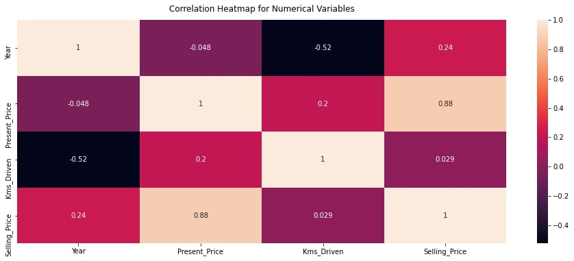
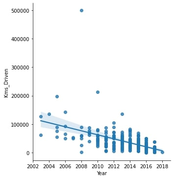
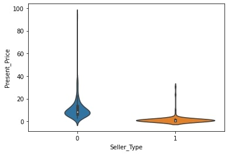
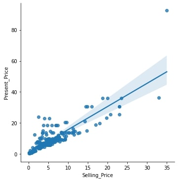
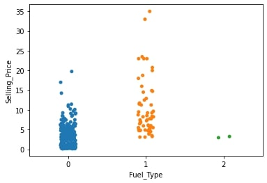
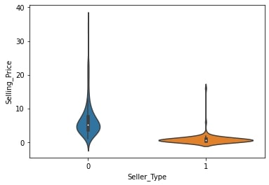
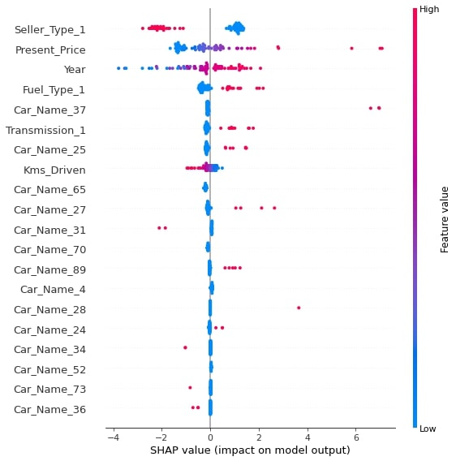

# Project 2: Vehicle Sales Price Prediction (Python)

This repository is for the analysis and modeling done on the Kaggle: Vehicle Sales dataset. Below you will find an overview of the data, code, and results. The goal of this project was to create an end-to-end project where I perform an exploratory data analysis, prepare the data (i.e., clean and feature engineer), apply machine learning algorithms to predict the sales price of vehicles, and create a [deployed application with a front end](https://predict-vehicle-price.herokuapp.com/) to productionize the best performing model. The repo for the app can be found [here](https://github.com/MichaelBryantDS/vehicle-price-pred-app).

### Code Used 

**Python Version:** 3.8.11 <br />
**Packages:** pandas, numpy, scipy, sklearn, matplotlib, seaborn, flask, statsmodels, shap, eli5, pickle<br />
**For Web Framework Requirements:**  ```pip install -r requirements.txt```  

## Vehicle Sales Dataset

The dataset was gathered from [Kaggle](https://www.kaggle.com/nehalbirla/vehicle-dataset-from-cardekho). The dataset contains 8 variables and 301 vehicle sales records.

### Variables

`Car_Name`, `Year`, `Selling_Price`, `Present_Price`, `Kms_Driven`, `Fuel_Type`, `Seller_Type`, `Transmission`, `Owner`

## Files

### eda-cleaning-engineering.py

This file contains the exploratory data analysis (EDA) and data cleaning. The EDA is performed using descriptive statistics, histograms to determine distributions, a correlation heatmap using the Pearson correlation coefficient, and ordinary least squares regression (to determine important variables with p-values and their impact through their coefficients). The cleaning is performed by assigning numbers to strings and features are engineered using dummy variables. The variables are scaled using MinMaxScaler.

### modeling.py

This file contains the modeling where I hyperparameter tune: LinearRegression, Lasso, Ridge, ElasticNet, RandomForestRegressor, GradientBoostingRegressor, SVR (support vector regression), StackingRegressor, VotingRegressor, BaggingRegressor, BaggingRegressor (with pasting), and AdaBoostRegressor. The models are hyperparameter tuned with GridSearchCV based on negative mean absolute error (NMAE) and the best models are judged based on mean square error (MSE), root mean square error (RMSE), MAE, and R-squared metrics. This file also contains code to derive the feature importance from the best models using shap and eli5. The scaler is pickled for use with the application.

### final-model.py

This file contains the best model (SVR) and it is pickled for use with the application.

## Results

### EDA

I looked at the distributions of the data and the correlations between variables. Below are some of the highlights:

<div align="center">
  
<figure>
<br/>
  <figcaption>Figure 1: Correlation heatmap for the numerical variables using the Pearson correlation coefficient.</figcaption>
</figure>
<br/><br/>
  
</div>

<div align="center">
  
<figure>
<br/>
  <figcaption>Figure 2: Scatter plot with regression model showing relationship between kilometers driven and year of vehicle.</figcaption>
</figure>
<br/><br/>
  
</div>

<div align="center">
  
<figure>
<br/>
  <figcaption>Figure 3: Violin plot showing a difference in distribution for present price between dealer (0) and individual (1) seller types.</figcaption>
</figure>
<br/><br/>
  
</div>

<div align="center">
  
<figure>
<br/>
  <figcaption>Figure 4: Scatter plot and regression model showing relationship between present price and selling price of the vehicles.</figcaption>
</figure>
<br/><br/>
  
</div>

<div align="center">
  
<figure>
<br/>
  <figcaption>Figure 5: Strip plot showing the different distributions for selling price between Petrol (0), Diesel (1), and CNG (3) fuel types.</figcaption>
</figure>
<br/><br/>
  
</div>

<div align="center">
  
<figure>
<br/>
  <figcaption>Figure 6: Violin plot showing a difference in distribution for selling price between dealer (0) and individual (1) seller types.</figcaption>
</figure>
<br/><br/>
  
</div>

### Data Cleaning

I cleaned the data to make the dataset usable for future modeling. I made the following changes:
* Capitalized all words in `Car_Name`
* Replaced strings with numbers for `Car_Name`, `Fuel_Type`, `Seller_Type`, `Transmission`, and `Owner`
* Assigned dtypes to all variables

### Featured Engineering

I feature engineered using the dataset for future modeling. I made the following changes:
* Created dummy variables for `Car_Name`, `Fuel_Type`, `Seller_Type`, `Transmission`, and `Owner`

### Model Building

First, I split the data into train and tests sets with a test set size of 25%.

I then hyperparameter tuned 12 different models and evaluated them using NMAE. I chose MAE because I didn't want the error to disproportionately represent the outliers.

The models I used were LinearRegression, Lasso, Ridge, ElasticNet, RandomForestRegressor, GradientBoostingRegressor, SVR, StackingRegressor, VotingRegressor, BaggingRegressor, BaggingRegressor (with pasting), and AdaBoostRegressor.

### Model Performance

SVR outperformed the other models on both the training and test sets, and in every metric. <br />
* MSE: 0.61430
* RMSE: 0.78377 (783.77 USD)
* MAE: 0.50269 (502.69 USD)
* R-squared: 0.97032

### Feature Importance

<div align="center">
  
<figure>
<br/>
  <figcaption>Figure 7: SHAP summary plot of the feature importance for the SVR model.</figcaption>
</figure>
<br/><br/>
  
</div>

## Productionization

## Resources

1. [Kaggle: Vehicle dataset](https://www.kaggle.com/nehalbirla/vehicle-dataset-from-cardekho)
2. [YouTube: Data Science Project from Scratch - Part 5 (Model Building) by Ken Jee](https://www.youtube.com/watch?v=7O4dpR9QMIM)
3. [GitHub: ds_salary_proj by PlayingNumbers](https://github.com/PlayingNumbers/ds_salary_proj)

